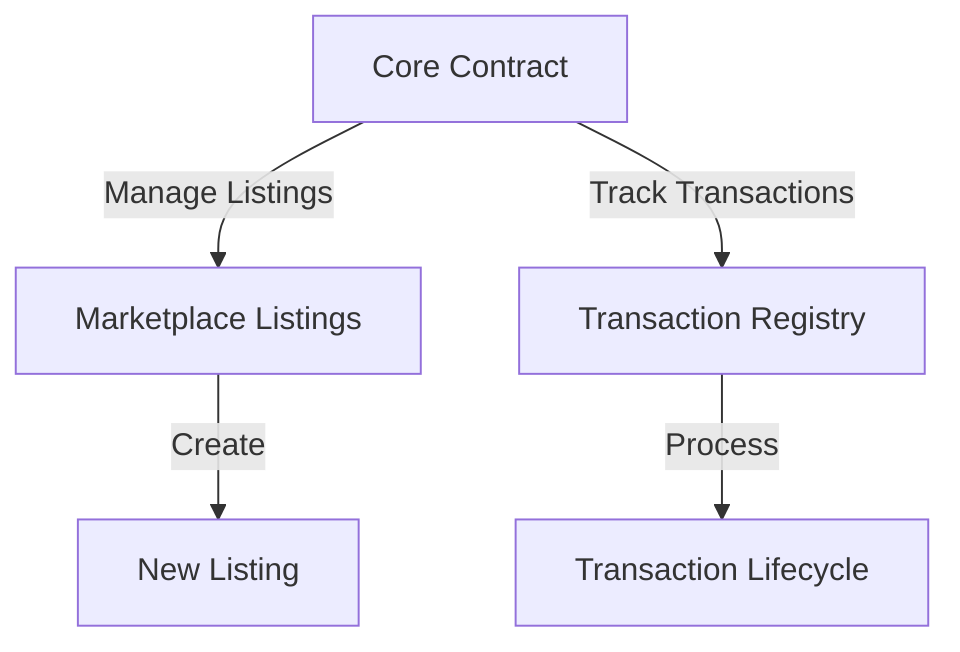

# Module Framework: Decentralized Marketplace Infrastructure

A flexible, modular smart contract framework for building secure peer-to-peer transaction platforms on the Stacks blockchain.

## Overview

Module Framework provides a robust, extensible infrastructure for creating decentralized marketplaces with:

- Modular contract design
- Secure transaction management
- Flexible listing and transaction tracking
- Scalable architecture for various use cases

## Key Features

- Dynamic listing creation
- Configurable transaction states
- Lightweight and extensible core contract
- Minimalist error handling
- Low gas consumption design

## Architecture



### Core Components

1. **Flexible Listing Management**
2. **Transaction Tracking**
3. **Configurable Status Handling**
4. **Minimal Overhead Design**

## Getting Started

### Prerequisites

- Clarinet
- Stacks Wallet
- Basic Clarity understanding

### Basic Usage

#### Creating a Listing

```clarity
(contract-call? .marketplace-core create-listing
    "Product Title"          ;; Title
    "Detailed Description"   ;; Description
    u1000000                 ;; Unit Price
    u10                      ;; Total Quantity
    "digital-goods"          ;; Category
)
```

### Development

#### Testing
```bash
clarinet test
```

#### Local Development
```bash
clarinet console
```

## Security Considerations

- Statically typed contract design
- Explicit validation checks
- Modular architecture for easier auditing

## Roadmap

- Enhanced listing attributes
- More flexible transaction models
- Plug-and-play marketplace modules

## Contributing

1. Fork the repository
2. Create feature branch
3. Commit changes
4. Push and create Pull Request

## License

MIT License